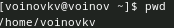
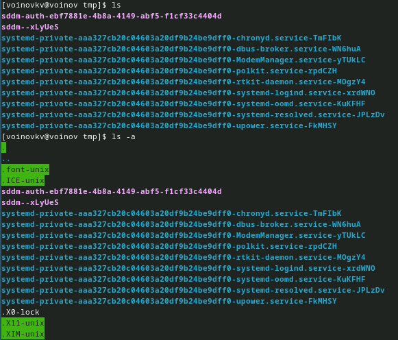
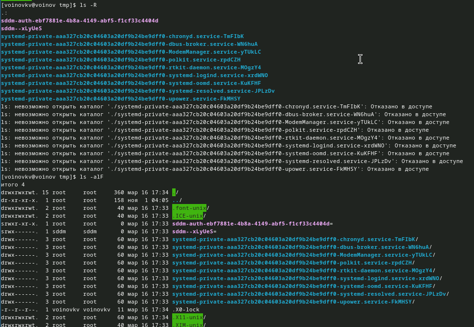
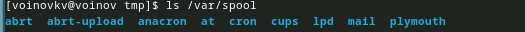
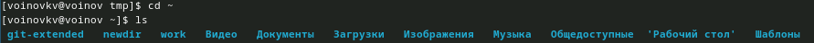
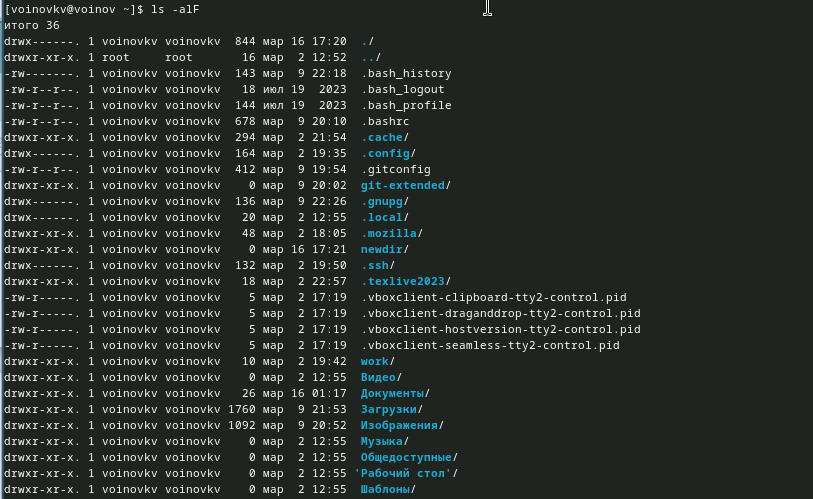
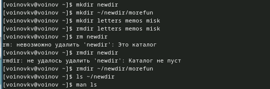
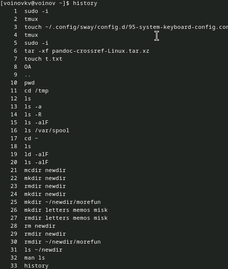
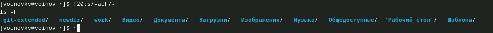

---
## Front matter
title: "Лабораторная работа № 6"
author: "Воинов Кирилл Викторович"

## Generic otions
lang: ru-RU
toc-title: "Содержание"

## Bibliography
bibliography: bib/cite.bib
csl: pandoc/csl/gost-r-7-0-5-2008-numeric.csl

## Pdf output format
toc: true # Table of contents
toc-depth: 2
lof: true # List of figures
lot: true # List of tables
fontsize: 12pt
linestretch: 1.5
papersize: a4
documentclass: scrreprt
## I18n polyglossia
polyglossia-lang:
  name: russian
  options:
	- spelling=modern
	- babelshorthands=true
polyglossia-otherlangs:
  name: english
## I18n babel
babel-lang: russian
babel-otherlangs: english
## Fonts
mainfont: PT Serif
romanfont: PT Serif
sansfont: PT Sans
monofont: PT Mono
mainfontoptions: Ligatures=TeX
romanfontoptions: Ligatures=TeX
sansfontoptions: Ligatures=TeX,Scale=MatchLowercase
monofontoptions: Scale=MatchLowercase,Scale=0.9
## Biblatex
biblatex: true
biblio-style: "gost-numeric"
biblatexoptions:
  - parentracker=true
  - backend=biber
  - hyperref=auto
  - language=auto
  - autolang=other*
  - citestyle=gost-numeric
## Pandoc-crossref LaTeX customization
figureTitle: "Рис."
tableTitle: "Таблица"
listingTitle: "Листинг"
lofTitle: "Список иллюстраций"
lotTitle: "Список таблиц"
lolTitle: "Листинги"
## Misc options
indent: true
header-includes:
  - \usepackage{indentfirst}
  - \usepackage{float} # keep figures where there are in the text
  - \floatplacement{figure}{H} # keep figures where there are in the text
---

# Цель работы

Приобретение практических навыков взаимодействия пользователя с системой посредством командной строки.

# Выполнение лабораторной работы

Определяю полное имя домашнего каталога.(рис. [-@fig:001]).

{#fig:001 width=70%}

Перехожу в каталог /tmp (рис. [-@fig:002]).

{#fig:002 width=70%}

Вывожу на экран содержимое каталога /tmp. (рис. [-@fig:003] и рис. [-@fig:004]).

{#fig:003 width=70%}

{#fig:004 width=70%}

Определяю, есть ли в каталоге /var/spool подкаталог с именем cron (да).(рис. [-@fig:005]).

{#fig:005 width=70%}

Перехожу в домашний каталог и вывожу на экран его содержимое. (рис. [-@fig:006]).

{#fig:006 width=70%}

Определяю, кто является владельцем файлов и подкаталогов. (рис. [-@fig:007]).

{#fig:007 width=70%}

В домашнем каталоге создаю новый каталог с именем newdir.
В каталоге ~/newdir создаю новый каталог с именем morefun.
В домашнем каталоге создаю одной командой три новых каталога с именами
letters, memos, misk. Затем удалю эти каталоги одной командой.
Попробую удалить ранее созданный каталог ~/newdir командой rm. 
Удалю каталог ~/newdir/morefun из домашнего каталога. (рис. [-@fig:008]).

{#fig:008 width=70%}

Просмотр содержимого не только указанного каталога и подкаталогов,
входящих в него "ls -R"

Просмотр содержимого c отсортированным по времени последнего изменения выводимый список содержимого каталога
с развёрнутым описанием файлов "ls -lt"

Используя информацию, полученную при помощи команды history, выполняю модификацию и исполнение нескольких команд из буфера команд. (рис. [-@fig:009] и рис. [-@fig:010]).

{#fig:009 width=70%}

{#fig:010 width=70%}

# Выводы

Я приобрел практические навыки взаимодействия пользователя с системой посредством командной строки.

# Контрольные вопросы

1. Командная строка - это текстовая система, которая передает команды компьютеру и возвращает результаты пользователю. 

2. Для определения абсолютного пути к текущему каталогу используется команда pwd. Например: если я введу pwd в своем домашнем каталоге то получу /home/voinovkv

3. С помощью команды ls можно определить имена файлов, при помощи опции -F уже мы сможем определить тип файлов, если нам необходимы скрытые файлы, добавим опцию -a. Пример есть в лабораторной работе.

4. С помощью команды ls можно определить имена файлов, если нам необходимы скрытые файлы, добавим опцию -a. Пример есть в лабораторной работе.

5. rmdir по умолчанию удаляет пустые каталоги, не удаляет файлы. rm удаляет файлы, без дополнительных опций (-d, -r) не будет удалять каталоги.

6. Вывести информацию о последних выполненных пользователем команд можно с помощью history. 

7. Используем синтаксис: !<номер команды> history:s/что заменяем/на что заменяем 

8. Предположим, я нахожусь не в домашнем каталоге. Если я введу “cd ; ls”, то окажусь в домашнем каталоге и получу вывод файлов внутри него.

9. Символ экранирования -  добавление перед спецсимволом обратный слеш, чтобы использовать специальный символ как обычный. Также позволяет читать системе название директорий с пробелом. Пример: cd work/Операционные системы/

10. Опция -l позволит увидеть дополнительную информацию о файлах в каталоге: время создания, владельца, права доступа

11. Относительный путь к файлу начинается из той директории, где вы находитесь (она сама не прописывается в пути), он прописывается относительно данной директории. Абсолютный путь начинается с корневого каталога.

12. Использовать man или –help

13. Клавиша Tab.
